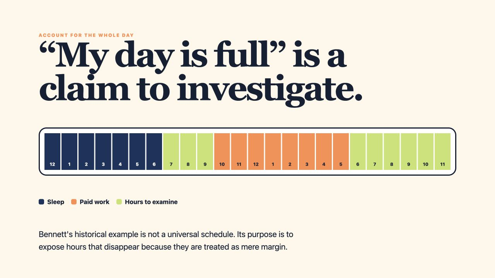
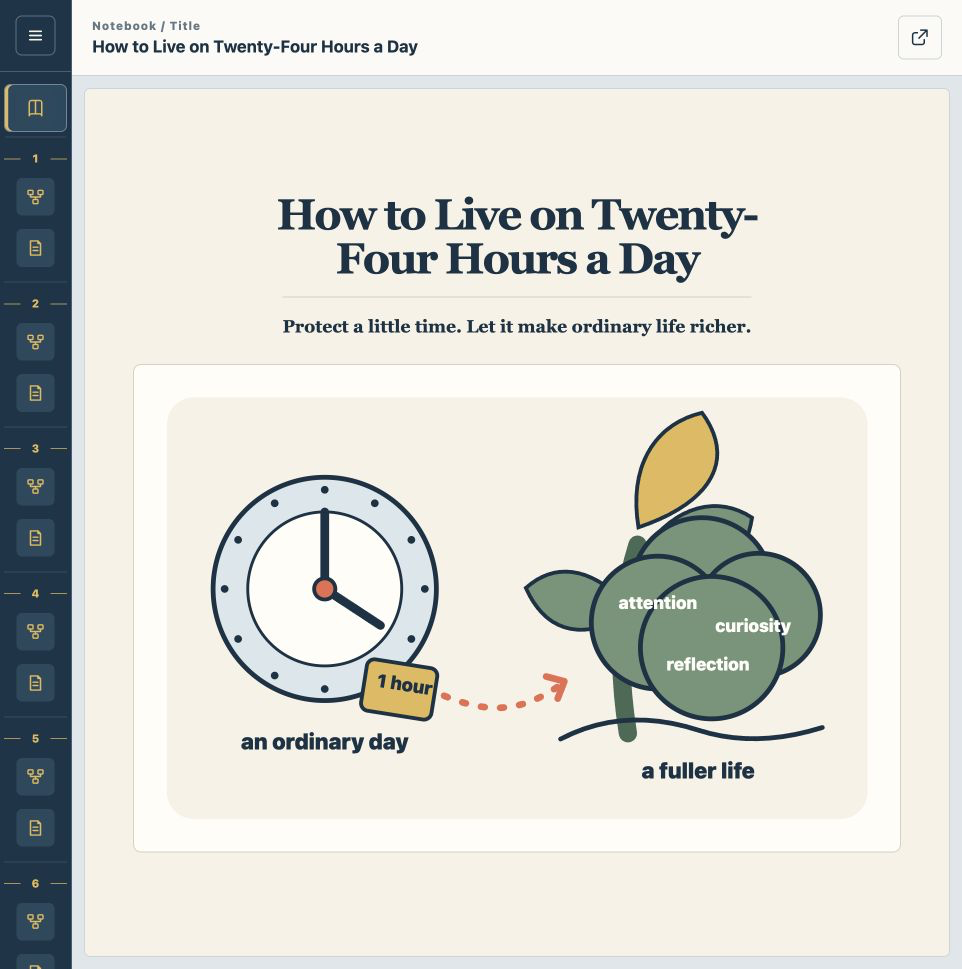

# eli20

[](https://github.com/game-dev-rta-club/eli20/actions/workflows/ci.yml)
[](https://github.com/game-dev-rta-club/eli20/releases/latest)
[](LICENSE)

Two agent skills built around one idea: explain unfamiliar material as if onboarding a 20-year-old new employee with no prior knowledge. They turn complex sources into visual explanations that are easy to understand and revisit.

The source can be a document, video, book, codebase, or other material. HTML is the output format, not an input requirement.

## /eli20

`/eli20` creates a visual-first onboarding explainer for one topic. Each screen presents one clear idea and one meaningful relationship through large diagrams, with only enough text to connect them into an easy-to-grasp whole.

[Read the `/eli20` skill instructions](skills/eli20/SKILL.md).



## /eli20-notebook

`/eli20-notebook` applies that approach to larger or initially unstructured material. It first plans understandable sections, then gives each section a Visual created with `/eli20` and a concise Summary. After every section is complete, it creates a visual title page from the notebook as a whole.

[Read the `/eli20-notebook` skill instructions](skills/eli20-notebook/SKILL.md).



[Open the live notebook sample](https://game-dev-rta-club.github.io/eli20/sample/) based on the public-domain book [*How to Live on Twenty-Four Hours a Day*](https://www.gutenberg.org/files/2274/2274-h/2274-h.htm).

## Install

Requires Node.js and Codex or Claude Code on macOS.

Run this from the project where you want to use the skills:

```sh
npx skills@latest add game-dev-rta-club/eli20
```

The installer lets you choose `eli20`, `eli20-notebook`, and the target agents. Installation is project-local by default, so it does not modify your user-level Codex or Claude Code configuration.

To install both skills for Codex and Claude Code without prompts:

```sh
npx skills@latest add game-dev-rta-club/eli20 \
  --skill eli20 \
  --skill eli20-notebook \
  --agent codex \
  --agent claude-code \
  --yes
```

Codex reads the project skills from `.agents/skills/`; Claude Code reads them from `.claude/skills/`. Start a new session if newly installed skills do not appear immediately.

## Use

In Codex:

```text
$eli20 Explain how Git branches work.
$eli20-notebook Summarize this document.
```

In Claude Code:

```text
/eli20 Explain how Git branches work.
/eli20-notebook Summarize this document.
```

## Development

```sh
git clone https://github.com/game-dev-rta-club/eli20.git
cd eli20
node --test tests/verify-skills.mjs
```

Local development requires Node.js 24 or later. No package installation is required.

## Contributing

Focused issues and pull requests are welcome. See [CONTRIBUTING.md](CONTRIBUTING.md) and the [Code of Conduct](CODE_OF_CONDUCT.md). Report vulnerabilities through the private process in [SECURITY.md](SECURITY.md).

## Maintainers

[Game Dev RTA Club](https://github.com/game-dev-rta-club)

## License

[MIT](LICENSE) © 2026 Game Dev RTA Club. Third-party attribution is recorded in [THIRD_PARTY_NOTICES.md](THIRD_PARTY_NOTICES.md).
